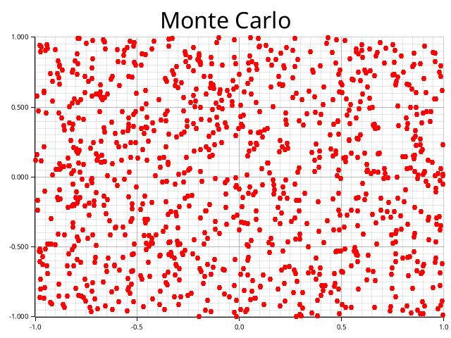

# Monte Carlo

Monte Carlo simulation to estimate the value of π. 

1. Generate random points between -1.0 and 1.0
2. Calculate distance for each point from origo
3. Count the amount of points within a quarter of the 0.5 radius circle in the middle
4. Estimate π using the ratio of points inside the circle to total number of points times 4

`3.1296 Δ:0.011399984`

- Run this before running the program `mkdir -p plotters-doc-data`